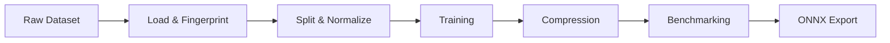

## Pipeline Overview

The system implements a linear pipeline with modular stages that execute deterministically:

<Steps>
  <Step title="Dataset Loading">
    Load and fingerprint the dataset with SHA-256 checksums for reproducibility
  </Step>
  <Step title="Split & Normalize">
    Perform stratified train/test split and apply L2 normalization
  </Step>
  <Step title="Training & Evaluation">
    Train baseline models (KNN/RF) and capture accuracy metrics
  </Step>
  <Step title="Compression">
    Apply optional pruning and quantization experiments
  </Step>
  <Step title="Benchmarking">
    Run hardware-constrained sweeps across batch sizes and memory budgets
  </Step>
  <Step title="Deployment">
    Export to ONNX and validate prediction parity
  </Step>
</Steps>

This linear structure ensures each stage is independently testable while enabling end-to-end execution from CLI entrypoints.

## Module Organization

The codebase is organized into domain-specific modules:

<CardGroup cols={2}>
  <Card title="research/" icon="flask">
    Core training logic, configuration, and data pipeline
  </Card>
  <Card title="compression/" icon="compress">
    Pruning and quantization implementations
  </Card>
  <Card title="benchmarks/" icon="gauge">
    Hardware simulation and performance profiling
  </Card>
  <Card title="deployment/" icon="rocket">
    ONNX export and runtime validation
  </Card>
</CardGroup>

### Configuration System

All pipeline behavior is controlled through typed configuration classes:

```python research/config.py
@dataclass
class SystemConfig:
    seed: int = 40
    sample_size: int = 6000
    test_size: float = 0.3
    normalize: bool = True
    dataset: str = "mnist"
    fail_fast_dataset: bool = False
    artifacts_dir: Path = Path("artifacts")
    confidence_z: float = 1.96

@dataclass
class TrainingConfig:
    model_name: str = "knn"
    knn_neighbors: int = 4
    knn_weights: str = "distance"
    knn_algorithm: str = "auto"
    rf_n_estimators: int = 500
    rf_max_features: str = "sqrt"
    rf_class_weight: str = "balanced"
    rf_random_state: int = 40
```

See the [Configuration Guide](/api/config) for all available options.

## Design Principles

### Deterministic Runs

Every experiment stage uses fixed seeds and controlled randomness:

- `SystemConfig.seed` controls train/test splitting
- `TrainingConfig.rf_random_state` controls Random Forest initialization
- Dataset checksums verify identical input data across runs

<Warning>
Deterministic settings improve reproducibility but can mask variance that appears in uncontrolled production environments.
</Warning>

### Artifact Capture

All metrics and metadata are persisted as JSON artifacts:

```python research/core/data/dataset.py
def save_dataset_metadata(config: SystemConfig, x: np.ndarray, y: np.ndarray, metadata: Dict) -> Path:
    path = config.artifacts_dir / "dataset_metadata.json"
    payload = {"config": asdict(config), "fingerprint": dataset_fingerprint(x, y, metadata)}
    payload["config"]["artifacts_dir"] = str(config.artifacts_dir)
    save_json(payload, path)
    return path
```

Artifacts include:
- Dataset fingerprints with SHA-256 checksums
- Training metrics (accuracy, confusion matrices)
- Compression statistics (pruning ratios, quantization losses)
- Benchmark results (latency, memory usage)
- ONNX parity validation results

### Modular Experiments

Each experiment mutates a single factor while preserving all other settings:

<Tabs>
  <Tab title="Pruning Sweep">
    Vary `weight_pruning_level` from 0.0 to 0.9 while keeping model architecture and dataset split constant
  </Tab>
  <Tab title="Batch Size Sweep">
    Test `auto_batch_sizes = (1, 8, 32, 64, 128)` while keeping model weights frozen
  </Tab>
  <Tab title="Model Comparison">
    Train KNN and RF on identical train/test splits for fair comparison
  </Tab>
</Tabs>

## Data Flow

Data flows unidirectionally through the pipeline:



### Stage Interfaces

1. **Load & Fingerprint**: `(x, y, metadata)` with SHA-256 checksums
2. **Split & Normalize**: `(x_train, x_test, y_train, y_test)` with L2 normalization
3. **Training**: Fitted scikit-learn model + baseline metrics
4. **Compression**: Modified model + compression statistics
5. **Benchmarking**: Performance metrics under hardware constraints
6. **ONNX Export**: `.onnx` file + parity validation results

## Design Motivations

<AccordionGroup>
  <Accordion title="Minimal Moving Parts">
    Scikit-learn baselines and NumPy preprocessing keep dependencies predictable. No deep learning frameworks required for core functionality.
  </Accordion>
  
  <Accordion title="Controlled Comparisons">
    Fixed seeds, stratified splits, and single-factor experiments enable fair model comparisons and reproducible results.
  </Accordion>
  
  <Accordion title="Auditability">
    All metrics and metadata stored as JSON artifacts provide full experiment transparency and debugging capabilities.
  </Accordion>
</AccordionGroup>

## Trade-offs

### Advantages

<Check>Low implementation complexity - pure Python with minimal dependencies</Check>
<Check>Fast iteration time - seconds to train, compress, and benchmark</Check>
<Check>Clear artifact outputs - JSON files for all metrics</Check>
<Check>Deterministic reproducibility - fixed seeds and checksums</Check>

### Limitations

<Warning>CPU-centric assumptions may under-represent accelerator behavior</Warning>
<Warning>Simplified hardware abstractions don't capture cycle-level details</Warning>
<Warning>No distributed training or inference orchestration</Warning>
<Warning>No automatic artifact retention policy for large sweep grids</Warning>

## Failure Modes

Understand common failure scenarios:

<Card title="Dataset Loading" icon="database">
  MNIST loading fails when network/cache unavailable. Use `--dataset digits` for offline runs or `--fail-fast-dataset` for strict validation.
</Card>

<Card title="KNN Inference" icon="clock">
  Inference cost scales with reference set size and can dominate latency. Consider prototype reduction for compression.
</Card>

<Card title="RF Memory" icon="memory">
  Memory footprint increases rapidly with `rf_n_estimators`. Monitor memory during large ensemble training.
</Card>

<Card title="ONNX Parity" icon="arrows-split-up-and-left">
  Conversion paths may alter numeric behavior. Tune `onnx_min_agreement` threshold based on deployment risk tolerance.
</Card>

## Next Steps

<CardGroup cols={2}>
  <Card title="Models" icon="brain" href="/concepts/models">
    Learn about KNN and Random Forest architectures
  </Card>
  <Card title="Datasets" icon="database" href="/concepts/datasets">
    Understand dataset loading and preprocessing
  </Card>
  <Card title="Configuration" icon="gear" href="/api/config">
    Configure all pipeline parameters
  </Card>
  <Card title="Deployment" icon="rocket" href="/guides/deployment">
    Export models to ONNX for production
  </Card>
</CardGroup>